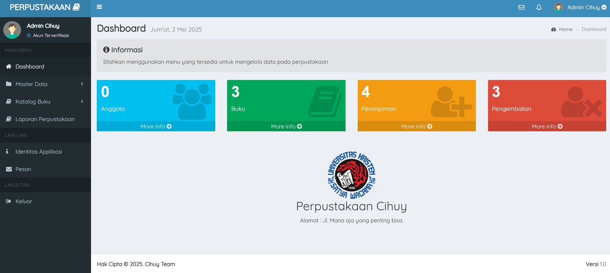

Aplikasi Perpustakaan Cihuy 📚

Aplikasi Perpustakaan Cihuy adalah sistem manajemen perpustakaan berbasis web yang dikembangkan menggunakan PHP dan MySQL. Aplikasi ini dirancang untuk memudahkan pengelolaan data perpustakaan seperti:
- Data anggota
- Data buku
- Peminjaman
- Pengembalian

✨ Fitur Utama
- Manajemen data anggota perpustakaan
- Manajemen data koleksi buku
- Pencatatan peminjaman dan pengembalian buku
- Laporan sederhana terkait aktivitas perpustakaan
- Antarmuka pengguna yang mudah digunakan

🛠️ Teknologi
- Backend: PHP
- Database: MySQL
- Frontend: HTML, CSS, JavaScript

🚀 Cara Install
Clone repository ini:

git clone https://github.com/username/nama-repo.git
Import file database (jika ada) ke MySQL melalui phpMyAdmin atau CLI.

Konfigurasi file koneksi database sesuai environment lokal kamu.

Jalankan aplikasi di server lokal (XAMPP, Laragon, dll.).

🖼️ Screenshot

Kontak
Jika Anda memiliki pertanyaan atau ingin berkolaborasi, silakan hubungi saya melalui:

- Email: [ samuelgaluhdiaspramudyagmail.com ]
- Instagram: [https://www.instagram.com/ssamga_]
- GitHub: [github.com/gamuelgaluh]
